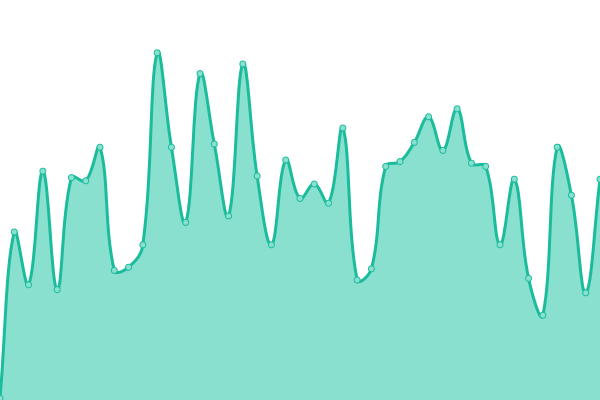
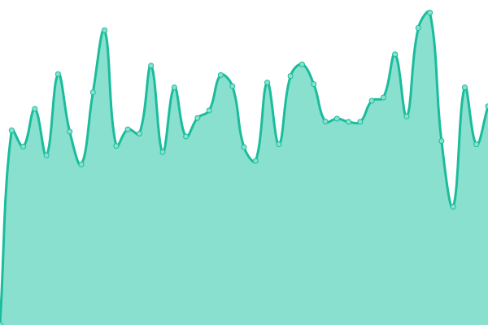
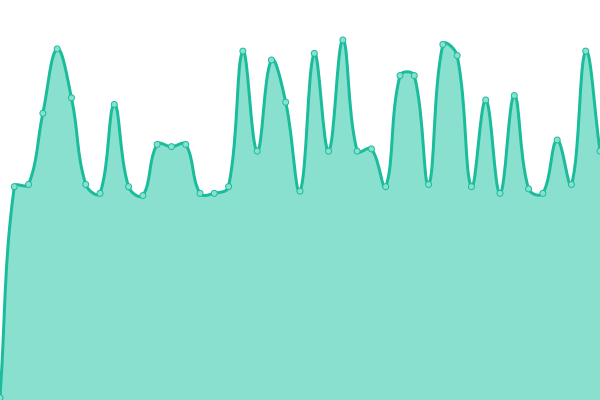
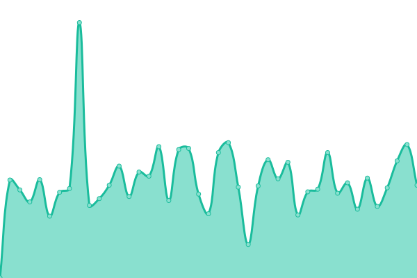
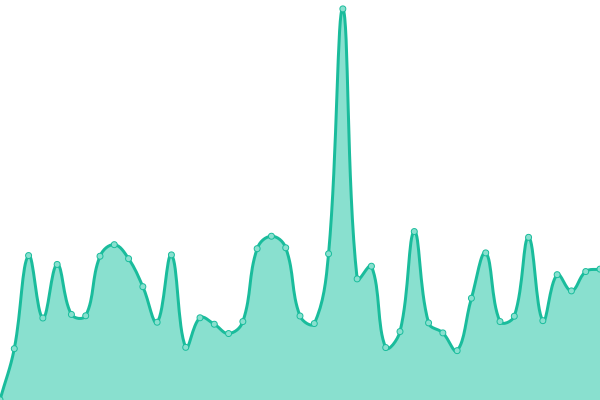

# [📈 Live Status](https://status.turkb.us): <!--live status--> **🟧 Partial outage**

This repository contains the open-source uptime monitor and status page for [Psychonaut Station](https://turkb.us), powered by [Upptime](https://github.com/upptime/upptime).

With [Upptime](https://upptime.js.org), you can get your own unlimited and free uptime monitor and status page, powered entirely by a GitHub repository. We use [Issues](https://github.com/psychonaut-station/status/issues) as incident reports, [Actions](https://github.com/psychonaut-station/status/actions) as uptime monitors, and [Pages](https://status.turkb.us) for the status page.

<!--start: status pages-->
<!-- This summary is generated by Upptime (https://github.com/upptime/upptime) -->
<!-- Do not edit this manually, your changes will be overwritten -->
<!-- prettier-ignore -->
| URL | Status | History | Response Time | Uptime |
| --- | ------ | ------- | ------------- | ------ |
|  [BYOND](https://www.byond.com/games/hub/exadv1/spacestation13) | 🟥 Down | [byond.yml](https://github.com/psychonaut-station/status/commits/HEAD/history/byond.yml) | 

 176ms
     
 | 

<a href="https://status.ss13.tr/history/byond">0.00%</a>
    

|  [Home Page](https://ss13.tr) | 🟩 Up | [home-page.yml](https://github.com/psychonaut-station/status/commits/HEAD/history/home-page.yml) | 

 607ms
     
 | 

<a href="https://status.ss13.tr/history/home-page">99.36%</a>
    

|  [Game Server](play.ss13.tr) | 🟩 Up | [game-server.yml](https://github.com/psychonaut-station/status/commits/HEAD/history/game-server.yml) | 

 121ms
     
 | 

<a href="https://status.ss13.tr/history/game-server">100.00%</a>
    

|  [API](https://api.ss13.tr) | 🟩 Up | [api.yml](https://github.com/psychonaut-station/status/commits/HEAD/history/api.yml) | 

 541ms
     
 | 

<a href="https://status.ss13.tr/history/api">100.00%</a>
    

|  [Wiki](https://wiki.ss13.tr/Ping) | 🟩 Up | [wiki.yml](https://github.com/psychonaut-station/status/commits/HEAD/history/wiki.yml) | 

 546ms
     
 | 

<a href="https://status.ss13.tr/history/wiki">99.36%</a>
    

<!--end: status pages-->

[**Visit our status website →**](https://status.turkb.us)

## 📄 License

- Powered by: [Upptime](https://github.com/upptime/upptime)
- Code: [MIT](./LICENSE) © [Anand Chowdhary](https://anandchowdhary.com), supported by [Pabio](https://pabio.com)
- Data in the `./history` directory: [Open Database License](https://opendatacommons.org/licenses/odbl/1-0/)
